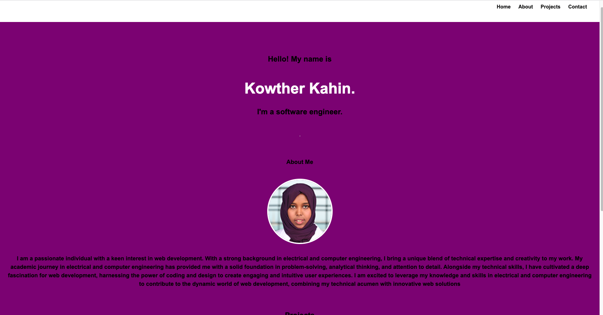

# Kowther-Portfolio

## Description
This project is the seconde challenge for week two module. We were asked to create a website from scratch without starting code.On this webpage you will find links to my previous projects, my educational background, and my profile picture. The webpage also connects you to my contact information in linkedin, github and email.

## Table of Contents
Installation
Usage
Credits

## Installation
To run the project in your local machine:
Open visual studio in your computer or laptop
Clone the git project: https://github.com/Kowther7/Kowther-Portfolio.git 
Pull the latest from the 'main' branch
Locate the index.html file
Right click on the file and select "Open in default browser"
A new window on your default browser should open with the web page containing the prework study guide
Access the deployed project here: https://kowther7.github.io/Kowther-Portfolio/

## Usage

After running the project you will be able to access my portfolio! Since I don't have any personal projects right now, all of them are listed as "project in progress". Stay tuned to see the updates on my site 😄 Click on the upper right nav menu to navigate to the different sections of my portfolio, and click oin each project (in the future) to access each one of the applications I've developed. Looking forward to see you back here!

## Screenshoot of the webpage 

## Credits
The main resources used:

Bootcamp canvas - Module 02
Strava icon & css from their official page

